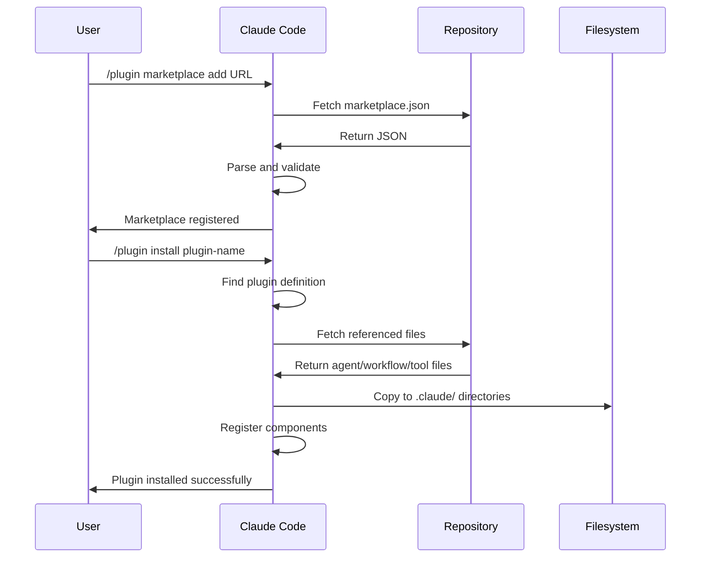

# Plugin Manifest API Specification

Complete technical specification for Claude Code plugin manifest format (`marketplace.json`), plugin definitions, metadata schemas, and installation mechanisms.

> **Documentation Status**: Plugin marketplaces were announced in public beta (January 2025). This specification is based on observed behavior, public announcements, and working implementations. For the most current official specifications, refer to the official documentation links below.

**Official Reference**: [Plugin Marketplaces](https://docs.claude.com/en/docs/claude-code/plugin-marketplaces) | [Plugins Reference](https://docs.claude.com/en/docs/claude-code/plugins-reference)

## Table of Contents

- [Specification Overview](#specification-overview)
- [Marketplace Manifest Format](#marketplace-manifest-format)
- [Plugin Definition Schema](#plugin-definition-schema)
- [Field Definitions](#field-definitions)
- [File Path References](#file-path-references)
- [Validation Rules](#validation-rules)
- [Categories and Keywords](#categories-and-keywords)
- [Installation Flow](#installation-flow)
- [Examples](#examples)
- [Best Practices](#best-practices)

## Specification Overview

Claude Code plugins are distributed through marketplace catalogs defined in `marketplace.json` files. Each marketplace can contain multiple plugins, and plugins reference agents, workflows, and tools within the repository.

**File Location**: `.claude-plugin/marketplace.json`

**Format**: JSON

**Purpose**:
- Define marketplace metadata and ownership
- Catalog available plugins
- Specify plugin dependencies and components
- Enable discovery through keywords and categories

**Official Documentation**: [Plugin Marketplaces](https://docs.claude.com/en/docs/claude-code/plugin-marketplaces)

## Marketplace Manifest Format

### Top-Level Structure

```json
{
  "name": "marketplace-name",
  "owner": {
    "name": "Owner Name",
    "email": "email@example.com",
    "url": "https://github.com/username"
  },
  "metadata": {
    "description": "Marketplace description",
    "version": "1.0.0"
  },
  "plugins": [
    { /* Plugin definition */ },
    { /* Plugin definition */ }
  ]
}
```

### Required Top-Level Fields

```json
{
  "name": "string",           // Required: Marketplace identifier
  "owner": { /* object */ },  // Required: Ownership information
  "plugins": [ /* array */ ]  // Required: Plugin catalog
}
```

### Optional Top-Level Fields

```json
{
  "metadata": {               // Optional: Marketplace metadata
    "description": "string",  // Marketplace purpose
    "version": "string"       // Semantic version
  }
}
```

## Plugin Definition Schema

### Complete Plugin Object

```json
{
  "name": "plugin-name",
  "source": "./",
  "description": "Plugin purpose and capabilities",
  "version": "1.0.0",
  "author": {
    "name": "Author Name",
    "url": "https://github.com/username"
  },
  "homepage": "https://github.com/username/repo",
  "repository": "https://github.com/username/repo",
  "license": "MIT",
  "keywords": [
    "keyword1",
    "keyword2"
  ],
  "category": "category-name",
  "strict": false,
  "commands": [
    "./workflows/workflow-file.md",
    "./tools/tool-file.md"
  ],
  "agents": [
    "./agents/agent-file.md"
  ]
}
```

### Required Plugin Fields

✅ **Must have**:
```json
{
  "name": "string",           // Unique plugin identifier
  "source": "string",         // Source directory path
  "description": "string",    // Plugin purpose
  "version": "string"         // Semantic version
}
```

### Recommended Plugin Fields

🔧 **Should have**:
```json
{
  "author": { /* object */ }, // Author information
  "homepage": "string",       // Plugin homepage URL
  "repository": "string",     // Source repository URL
  "license": "string",        // License identifier
  "keywords": [ /* array */ ],// Searchable keywords
  "category": "string"        // Plugin category
}
```

### Optional Plugin Fields

🎨 **Can have**:
```json
{
  "strict": boolean,          // Strict validation mode
  "commands": [ /* array */ ],// Workflow/tool file paths
  "agents": [ /* array */ ]   // Agent file paths
}
```

## Field Definitions

### Marketplace Fields

#### `name` (required)

**Type**: `string`
**Format**: Kebab-case identifier
**Purpose**: Unique marketplace identifier

**Example**:
```json
"name": "claude-code-workflows"
```

#### `owner` (required)

**Type**: `object`
**Purpose**: Marketplace ownership information

**Schema**:
```json
{
  "name": "string",   // Owner display name
  "email": "string",  // Contact email (optional)
  "url": "string"     // Owner profile URL (optional)
}
```

**Example**:
```json
"owner": {
  "name": "Seth Hobson",
  "email": "seth@major7apps.com",
  "url": "https://github.com/wshobson"
}
```

#### `metadata` (optional)

**Type**: `object`
**Purpose**: Marketplace-level metadata

**Schema**:
```json
{
  "description": "string",  // Marketplace description
  "version": "string"       // Semantic version (e.g., "1.0.0")
}
```

**Example**:
```json
"metadata": {
  "description": "Production-ready workflow orchestration system with 83 specialized agents",
  "version": "1.0.0"
}
```

#### `plugins` (required)

**Type**: `array<PluginDefinition>`
**Purpose**: Catalog of available plugins

**Example**:
```json
"plugins": [
  {
    "name": "claude-code-essentials",
    /* ... plugin definition ... */
  },
  {
    "name": "full-stack-development",
    /* ... plugin definition ... */
  }
]
```

### Plugin Fields

#### `name` (required)

**Type**: `string`
**Format**: Kebab-case, lowercase, no spaces
**Purpose**: Unique plugin identifier within marketplace

**Naming Conventions**:
- Use hyphen-separated words
- Descriptive and specific
- Avoid generic names
- Keep concise but clear

**Valid Examples**:
```json
"name": "claude-code-essentials"
"name": "full-stack-development"
"name": "security-hardening"
"name": "api-development-kit"
```

**Invalid Examples**:
```json
"name": "Claude Code Essentials"  // Spaces not allowed
"name": "full_stack_development"  // Underscores not preferred
"name": "essentials"              // Too generic
```

#### `source` (required)

**Type**: `string`
**Purpose**: Root directory containing plugin files
**Format**: Relative path from marketplace.json location

**Common Values**:
```json
"source": "./"              // Current directory
"source": "./plugins/name"  // Subdirectory
```

#### `description` (required)

**Type**: `string`
**Purpose**: Clear description of plugin capabilities and use cases
**Format**: Multi-sentence string describing purpose and components

**Structure**:
1. Primary purpose (what it does)
2. Key capabilities (specific features)
3. Target use cases (when to use)

**Example**:
```json
"description": "Multi-agent workflow orchestrating backend API design, frontend implementation, mobile development, testing, security review, and deployment automation for complete feature implementation"
```

**Good Descriptions**:
- Start with action or capability
- List specific technologies/frameworks
- Mention included components
- Describe target scenarios

**Bad Descriptions**:
- Vague or generic statements
- Missing component details
- No use case context
- Overly technical jargon

#### `version` (required)

**Type**: `string`
**Format**: Semantic versioning (MAJOR.MINOR.PATCH)
**Purpose**: Track plugin version

**Format**: `MAJOR.MINOR.PATCH`
- **MAJOR**: Breaking changes
- **MINOR**: New features, backward compatible
- **PATCH**: Bug fixes, backward compatible

**Examples**:
```json
"version": "1.0.0"   // Initial release
"version": "1.2.3"   // Minor update with patch
"version": "2.0.0"   // Major breaking change
```

#### `author` (recommended)

**Type**: `object`
**Purpose**: Plugin author information

**Schema**:
```json
{
  "name": "string",   // Required: Author name
  "url": "string"     // Optional: Author profile URL
}
```

**Example**:
```json
"author": {
  "name": "Seth Hobson",
  "url": "https://github.com/wshobson"
}
```

#### `homepage` (recommended)

**Type**: `string`
**Format**: Valid HTTP/HTTPS URL
**Purpose**: Plugin homepage or documentation URL

**Example**:
```json
"homepage": "https://github.com/wshobson/agents"
```

#### `repository` (recommended)

**Type**: `string`
**Format**: Valid HTTP/HTTPS URL
**Purpose**: Source code repository URL

**Example**:
```json
"repository": "https://github.com/wshobson/agents"
```

#### `license` (recommended)

**Type**: `string`
**Format**: SPDX license identifier
**Purpose**: Plugin license

**Common Values**:
```json
"license": "MIT"
"license": "Apache-2.0"
"license": "GPL-3.0"
"license": "BSD-3-Clause"
"license": "ISC"
```

#### `keywords` (recommended)

**Type**: `array<string>`
**Purpose**: Searchable terms for plugin discovery

**Guidelines**:
- Use lowercase
- Hyphenate multi-word terms
- Include technology names
- Add use case keywords
- Mention frameworks and tools
- List problem domains

**Example**:
```json
"keywords": [
  "full-stack",
  "api-design",
  "frontend",
  "mobile",
  "react",
  "nextjs",
  "rest-api",
  "graphql",
  "typescript"
]
```

**Keyword Categories**:
- **Technologies**: "react", "python", "kubernetes"
- **Use Cases**: "testing", "deployment", "security"
- **Frameworks**: "fastapi", "django", "express"
- **Domains**: "machine-learning", "blockchain", "fintech"
- **Tasks**: "optimization", "debugging", "documentation"

#### `category` (recommended)

**Type**: `string`
**Purpose**: Primary plugin classification

**Standard Categories**:
- `essentials`: Core development tools
- `workflows`: Multi-agent orchestration workflows
- `development`: Development utilities and tools
- `quality`: Testing and quality assurance
- `infrastructure`: DevOps and infrastructure
- `utilities`: General-purpose utilities
- `documentation`: Documentation generation
- `database`: Database operations
- `marketing`: SEO and content optimization
- `business`: Business operations and analytics
- `blockchain`: Web3 and blockchain development
- `finance`: Financial and trading systems
- `payments`: Payment processing
- `gaming`: Game development
- `accessibility`: Accessibility and compliance

**Example**:
```json
"category": "workflows"
```

#### `strict` (optional)

**Type**: `boolean`
**Default**: `false`
**Purpose**: Enable strict validation mode

**Behaviour**:
- `false`: Permissive installation (default)
- `true`: Strict validation of all references

**Example**:
```json
"strict": false
```

**When to use `strict: true`**:
- Production-critical plugins
- Plugins with external dependencies
- Plugins requiring complete installation
- Enterprise or compliance-focused plugins

#### `commands` (optional)

**Type**: `array<string>`
**Purpose**: List of workflow and tool files to install
**Format**: Relative paths from `source` directory

**Example**:
```json
"commands": [
  "./workflows/feature-development.md",
  "./workflows/full-stack-feature.md",
  "./tools/api-scaffold.md",
  "./tools/security-scan.md"
]
```

**Path Requirements**:
- Must be relative to `source` directory
- Must point to existing `.md` files
- Typically in `workflows/` or `tools/` subdirectories

#### `agents` (optional)

**Type**: `array<string>`
**Purpose**: List of agent files to install
**Format**: Relative paths from `source` directory

**Example**:
```json
"agents": [
  "./agents/backend-architect.md",
  "./agents/frontend-developer.md",
  "./agents/test-automator.md"
]
```

**Path Requirements**:
- Must be relative to `source` directory
- Must point to existing `.md` files with valid agent frontmatter
- Typically in `agents/` subdirectory

## File Path References

### Path Resolution

All file paths in plugins are relative to the `source` directory:

```json
{
  "source": "./",
  "commands": [
    "./workflows/feature-development.md"  // Resolves to ./workflows/feature-development.md
  ],
  "agents": [
    "./agents/backend-architect.md"       // Resolves to ./agents/backend-architect.md
  ]
}
```

### Path Validation

During installation, Claude Code validates:

✅ **File Existence**: All referenced files must exist
✅ **File Format**: Must be `.md` files
✅ **Agent Frontmatter**: Agent files must have valid YAML frontmatter
✅ **Workflow Structure**: Workflow files must follow workflow format

### Common Path Patterns

**Typical Structure**:
```
repository/
├── .claude-plugin/
│   └── marketplace.json
├── agents/
│   ├── backend-architect.md
│   └── frontend-developer.md
├── workflows/
│   └── feature-development.md
└── tools/
    └── api-scaffold.md
```

**Plugin Definition**:
```json
{
  "source": "./",
  "commands": [
    "./workflows/feature-development.md",
    "./tools/api-scaffold.md"
  ],
  "agents": [
    "./agents/backend-architect.md",
    "./agents/frontend-developer.md"
  ]
}
```

## Validation Rules

### Marketplace Validation

✅ **Valid marketplace.json**:
```json
{
  "name": "my-marketplace",
  "owner": {
    "name": "John Doe",
    "url": "https://github.com/johndoe"
  },
  "plugins": [
    { /* valid plugin */ }
  ]
}
```

❌ **Invalid - missing required fields**:
```json
{
  "plugins": [...]  // Missing 'name' and 'owner'
}
```

❌ **Invalid - wrong types**:
```json
{
  "name": "my-marketplace",
  "owner": "John Doe",  // Should be object
  "plugins": {...}      // Should be array
}
```

### Plugin Validation

✅ **Valid plugin**:
```json
{
  "name": "my-plugin",
  "source": "./",
  "description": "Clear description of plugin capabilities",
  "version": "1.0.0",
  "author": {
    "name": "John Doe"
  },
  "keywords": ["keyword1", "keyword2"],
  "category": "development",
  "commands": ["./tools/tool.md"],
  "agents": ["./agents/agent.md"]
}
```

✅ **Valid minimal plugin**:
```json
{
  "name": "minimal-plugin",
  "source": "./",
  "description": "Minimal valid plugin",
  "version": "1.0.0"
}
```

❌ **Invalid - missing required fields**:
```json
{
  "name": "incomplete-plugin"
  // Missing: source, description, version
}
```

❌ **Invalid - wrong name format**:
```json
{
  "name": "My Plugin Name",  // Spaces not allowed
  "source": "./",
  "description": "Description",
  "version": "1.0.0"
}
```

❌ **Invalid - wrong version format**:
```json
{
  "name": "my-plugin",
  "source": "./",
  "description": "Description",
  "version": "v1.0"  // Must be semantic version (1.0.0)
}
```

❌ **Invalid - wrong array types**:
```json
{
  "name": "my-plugin",
  "source": "./",
  "description": "Description",
  "version": "1.0.0",
  "keywords": "keyword1, keyword2",  // Must be array
  "commands": "./tools/tool.md"      // Must be array
}
```

### File Path Validation

✅ **Valid paths**:
```json
"commands": [
  "./workflows/feature-development.md",
  "./tools/api-scaffold.md"
]
```

❌ **Invalid - absolute paths**:
```json
"commands": [
  "/workflows/feature-development.md"  // Must be relative
]
```

❌ **Invalid - missing file extension**:
```json
"commands": [
  "./workflows/feature-development"  // Must include .md
]
```

❌ **Invalid - wrong file type**:
```json
"commands": [
  "./workflows/config.json"  // Must be .md files
]
```

## Categories and Keywords

### Standard Categories

| Category | Purpose | Example Plugins |
|----------|---------|-----------------|
| **essentials** | Core development tools | code-reviewer, debugger, docs-generator |
| **workflows** | Multi-agent orchestration | feature-development, full-stack-feature |
| **development** | Development utilities | api-scaffold, refactoring tools |
| **quality** | Testing and QA | test-automation, code-review |
| **infrastructure** | DevOps and infra | kubernetes, terraform, docker |
| **utilities** | General utilities | dependency-audit, tech-debt-tracker |
| **documentation** | Docs generation | api-docs, diagram-generation |
| **database** | Database operations | schema-design, query-optimization |
| **marketing** | SEO and content | seo-optimization, content-writing |
| **business** | Business operations | analytics, reporting, hr-tools |
| **blockchain** | Web3 development | smart-contracts, defi-protocols |
| **finance** | Financial systems | trading-algorithms, risk-management |
| **payments** | Payment processing | stripe-integration, checkout-flows |
| **gaming** | Game development | unity-tools, game-mechanics |
| **accessibility** | A11y compliance | wcag-auditing, screen-reader-testing |

### Keyword Best Practices

**Technology Stack**:
```json
"keywords": ["python", "fastapi", "postgres", "redis", "docker"]
```

**Use Cases**:
```json
"keywords": ["api-development", "testing", "deployment", "monitoring"]
```

**Frameworks**:
```json
"keywords": ["react", "nextjs", "django", "kubernetes", "terraform"]
```

**Problem Domains**:
```json
"keywords": ["security", "performance", "scalability", "reliability"]
```

**Mixed**:
```json
"keywords": [
  "full-stack",
  "api-design",
  "react",
  "fastapi",
  "testing",
  "deployment"
]
```

## Installation Flow

### Marketplace Addition

```bash
/plugin marketplace add https://github.com/wshobson/agents
```

**Process**:
1. Claude Code fetches `.claude-plugin/marketplace.json`
2. Parses marketplace metadata
3. Registers marketplace in Claude Code
4. Makes plugins available for browsing

### Plugin Installation

```bash
/plugin install plugin-name
```

**Process**:
1. Locate plugin definition in marketplace
2. Resolve `source` directory
3. Validate all file path references
4. Copy workflow/tool files to `.claude/commands/`
5. Copy agent files to `.claude/agents/`
6. Register components in Claude Code

### Installation Diagram



## Examples

### Example 1: Essentials Plugin

**Purpose**: Core daily development tools

```json
{
  "name": "claude-code-essentials",
  "source": "./",
  "description": "Code explanation, debugging, documentation generation, PR enhancement, and git workflow tools for daily development tasks",
  "version": "1.0.0",
  "author": {
    "name": "Seth Hobson",
    "url": "https://github.com/wshobson"
  },
  "homepage": "https://github.com/wshobson/agents",
  "repository": "https://github.com/wshobson/agents",
  "license": "MIT",
  "keywords": [
    "beginner",
    "starter",
    "essential",
    "code-explanation",
    "debugging",
    "documentation",
    "git",
    "pull-request"
  ],
  "category": "essentials",
  "strict": false,
  "commands": [
    "./tools/code-explain.md",
    "./tools/smart-debug.md",
    "./tools/doc-generate.md",
    "./tools/pr-enhance.md",
    "./workflows/git-workflow.md"
  ],
  "agents": [
    "./agents/code-reviewer.md",
    "./agents/debugger.md",
    "./agents/docs-architect.md"
  ]
}
```

### Example 2: Full-Stack Development Plugin

**Purpose**: Complete feature development orchestration

```json
{
  "name": "full-stack-development",
  "source": "./",
  "description": "Multi-agent workflow orchestrating backend API design, frontend implementation, mobile development, testing, security review, and deployment automation for complete feature implementation",
  "version": "1.0.0",
  "author": {
    "name": "Seth Hobson",
    "url": "https://github.com/wshobson"
  },
  "homepage": "https://github.com/wshobson/agents",
  "repository": "https://github.com/wshobson/agents",
  "license": "MIT",
  "keywords": [
    "full-stack",
    "api-design",
    "frontend",
    "mobile",
    "react",
    "nextjs",
    "rest-api",
    "graphql",
    "typescript"
  ],
  "category": "workflows",
  "strict": false,
  "commands": [
    "./workflows/feature-development.md",
    "./workflows/full-stack-feature.md"
  ],
  "agents": [
    "./agents/backend-architect.md",
    "./agents/frontend-developer.md",
    "./agents/test-automator.md",
    "./agents/security-auditor.md",
    "./agents/deployment-engineer.md"
  ]
}
```

### Example 3: Security Hardening Plugin

**Purpose**: Comprehensive security implementation

```json
{
  "name": "security-hardening",
  "source": "./",
  "description": "OWASP vulnerability scanning, penetration testing workflows, security-focused code review, compliance validation for SOC2/HIPAA/GDPR, and automated security remediation",
  "version": "1.0.0",
  "author": {
    "name": "Seth Hobson",
    "url": "https://github.com/wshobson"
  },
  "homepage": "https://github.com/wshobson/agents",
  "repository": "https://github.com/wshobson/agents",
  "license": "MIT",
  "keywords": [
    "security",
    "vulnerability-assessment",
    "owasp",
    "penetration-testing",
    "compliance",
    "soc2",
    "hipaa",
    "gdpr",
    "devsecops"
  ],
  "category": "workflows",
  "strict": false,
  "commands": [
    "./workflows/security-hardening.md",
    "./tools/security-scan.md",
    "./tools/compliance-check.md"
  ],
  "agents": [
    "./agents/security-auditor.md",
    "./agents/backend-security-coder.md",
    "./agents/frontend-security-coder.md"
  ]
}
```

### Example 4: Minimal Plugin

**Purpose**: Minimal valid plugin definition

```json
{
  "name": "minimal-plugin",
  "source": "./",
  "description": "A minimal plugin with only required fields for demonstration purposes",
  "version": "1.0.0"
}
```

### Example 5: Complete Marketplace

**File**: `.claude-plugin/marketplace.json`

```json
{
  "name": "claude-code-workflows",
  "owner": {
    "name": "Seth Hobson",
    "email": "seth@major7apps.com",
    "url": "https://github.com/wshobson"
  },
  "metadata": {
    "description": "Production-ready workflow orchestration system",
    "version": "1.0.0"
  },
  "plugins": [
    {
      "name": "claude-code-essentials",
      "source": "./",
      "description": "Essential daily development tools",
      "version": "1.0.0",
      "category": "essentials",
      "commands": ["./tools/code-explain.md"],
      "agents": ["./agents/code-reviewer.md"]
    },
    {
      "name": "full-stack-development",
      "source": "./",
      "description": "Complete feature development workflow",
      "version": "1.0.0",
      "category": "workflows",
      "commands": ["./workflows/feature-development.md"],
      "agents": ["./agents/backend-architect.md"]
    }
  ]
}
```

## Best Practices

### 1. Marketplace Organisation

✅ **Do**:
- Use clear, descriptive marketplace name
- Provide complete owner information
- Include marketplace metadata
- Group related plugins logically
- Maintain consistent versioning

❌ **Don't**:
- Use vague marketplace names
- Omit contact information
- Skip version tracking
- Mix unrelated plugins randomly
- Create duplicate plugin names

### 2. Plugin Naming

✅ **Do**:
- Use kebab-case consistently
- Choose descriptive, specific names
- Indicate purpose in name
- Keep names concise (2-4 words)

❌ **Don't**:
- Use spaces or underscores
- Create overly long names
- Use generic names ("tools", "utilities")
- Mix naming conventions

### 3. Plugin Descriptions

✅ **Do**:
- Start with primary purpose
- List specific capabilities
- Mention key technologies
- Describe target use cases
- Keep under 200 characters for discovery

❌ **Don't**:
- Write vague descriptions
- Omit key technologies
- Use marketing jargon
- Forget target audience

### 4. Keywords and Categories

✅ **Do**:
- Include technology names
- Add use case keywords
- Use standard categories
- Think about search terms
- Cover problem domains

❌ **Don't**:
- Use ambiguous keywords
- Create custom categories unnecessarily
- Duplicate information in keywords
- Ignore SEO for discovery

### 5. File References

✅ **Do**:
- Use relative paths consistently
- Organize files in standard directories
- Validate all paths before publishing
- Include file extensions (.md)
- Document any non-standard structure

❌ **Don't**:
- Use absolute paths
- Mix path conventions
- Reference non-existent files
- Omit file extensions
- Create deeply nested structures

### 6. Versioning

✅ **Do**:
- Follow semantic versioning strictly
- Increment version for all changes
- Document breaking changes (major)
- Update version in all plugins
- Maintain changelog

❌ **Don't**:
- Use non-semantic versions
- Forget to update versions
- Skip version documentation
- Create version conflicts

### 7. Component Selection

✅ **Do**:
- Group related agents/workflows/tools
- Create focused, purposeful plugins
- Consider user workflows
- Balance plugin size
- Avoid unnecessary dependencies

❌ **Don't**:
- Create monolithic plugins
- Split related components across plugins
- Include unrelated components
- Create circular dependencies

## References

### Official Documentation

- [Plugin Marketplaces](https://docs.claude.com/en/docs/claude-code/plugin-marketplaces)
- [Plugins Reference](https://docs.claude.com/en/docs/claude-code/plugins-reference)
- [Plugins](https://docs.claude.com/en/docs/claude-code/plugins)
- [Subagents](https://docs.claude.com/en/docs/claude-code/sub-agents)

### Related Documentation

- [System Architecture Overview](../architecture/system-overview.md)
- [Agent Frontmatter Specification](./agent-frontmatter-spec.md)
- [Workflow Specification](./workflow-spec.md)

### Repository Examples

- [marketplace.json](../../.claude-plugin/marketplace.json) - Complete marketplace with 24 plugins
- [agents/](../../agents/) - 84 agent examples
- [workflows/](../../workflows/) - 15 workflow examples
- [tools/](../../tools/) - 42 tool examples

---

**Next Steps**:
- Review [System Architecture Overview](../architecture/system-overview.md) for marketplace mechanics
- Study [marketplace.json](../../.claude-plugin/marketplace.json) for real examples
- Explore plugin categories and keyword patterns
- Create custom plugins for your team's specific needs
