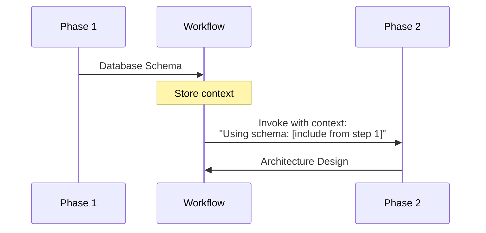

# Workflow API Specification

Complete technical specification for Claude Code workflow format, orchestration patterns, phase definitions, Task tool integration, and coordination strategies.

**Official Reference**: [Claude Code Subagents](https://docs.claude.com/en/docs/claude-code/sub-agents)

## Table of Contents

- [Specification Overview](#specification-overview)
- [File Format](#file-format)
- [Workflow Structure Elements](#workflow-structure-elements)
- [Phase Definition Format](#phase-definition-format)
- [Task Tool Invocation](#task-tool-invocation)
- [Configuration Options](#configuration-options)
- [Context Passing](#context-passing)
- [Validation Rules](#validation-rules)
- [Orchestration Patterns](#orchestration-patterns)
- [Examples](#examples)
- [Best Practices](#best-practices)

## Specification Overview

Workflows orchestrate multiple specialized agents through structured phases to accomplish complex development tasks. Each workflow:

- Defines sequential or parallel execution phases
- Invokes agents using the Task tool
- Passes context between phases explicitly
- Specifies configuration options and success criteria
- Documents coordination patterns and rollback strategies

**File Location**:
- Project-level: `.claude/workflows/`
- User-level: `~/.claude/workflows/`

**File Format**: Markdown (`.md`) with structured sections

## File Format

### Basic Structure

```markdown
Brief description of workflow purpose and approach.

[Extended thinking: Detailed explanation of workflow strategy,
coordination approach, and architectural considerations.]

## Configuration Options

### Option Category
- **option-name**: Description and possible values

## Phase N: Phase Name

### Step N.M: Step Description
- Use Task tool with subagent_type="agent-name"
- Prompt: "Detailed task description with context references..."
- Expected output: What this step produces
- Context: Information passed from previous phases

## Success Criteria

- Measurable success criteria
- Quality gates and thresholds
- Deployment validation requirements

## Coordination Notes

- Inter-phase dependencies
- Context passing requirements
- Rollback procedures

Feature/task description: $ARGUMENTS
```

### Required Sections

✅ **Must have**:
- Opening description with [Extended thinking] block
- Phase definitions with numbered steps
- Task tool invocations for each step
- Success criteria section

🔧 **Recommended**:
- Configuration Options section
- Coordination Notes section
- Rollback/failure strategy
- Execution parameters documentation

## Workflow Structure Elements

### Extended Thinking Block

Appears at the top of every workflow file:

```markdown
Brief one-line summary of workflow purpose.

[Extended thinking: This workflow coordinates X agents to achieve Y.
The approach follows Z principles, ensuring A, B, and C. Each phase
builds upon previous outputs to maintain consistency and quality.]
```

**Purpose**:
- Provides context for orchestrating agent
- Explains workflow strategy and coordination approach
- Documents architectural principles and quality gates

### Configuration Options

Define workflow parameters and modes:

```markdown
## Configuration Options

### Development Methodology
- **traditional**: Sequential development with testing after implementation
- **tdd**: Test-Driven Development with red-green-refactor cycles
- **bdd**: Behavior-Driven Development with scenario-based testing
- **ddd**: Domain-Driven Design with bounded contexts

### Feature Complexity
- **simple**: Single service, minimal integration (1-2 days)
- **medium**: Multiple services, moderate integration (3-5 days)
- **complex**: Cross-domain, extensive integration (1-2 weeks)
- **epic**: Major architectural changes, multiple teams (2+ weeks)
```

**Common Option Categories**:
- Development methodology
- Feature complexity levels
- Deployment strategies
- Testing depth requirements
- Compliance frameworks
- Technology stack choices

### Arguments Variable

Workflows accept input via `$ARGUMENTS`:

```markdown
Feature to implement: $ARGUMENTS
```

This placeholder gets replaced with user input when workflow is invoked.

## Phase Definition Format

### Phase Structure

```markdown
## Phase N: Phase Name

### Step N.M: Step Description
- Use Task tool with subagent_type="agent-name"
- Prompt: "Task description for agent with context..."
- Expected output: What this step produces
- Context: Information from previous phases
- [Optional] Validation: How to verify step success
- [Optional] Constraint: Limitations or requirements
- [Optional] Gate: Blocking condition before proceeding
```

### Numbering Convention

**Phases**: `## Phase 1:`, `## Phase 2:`, etc.
**Steps**: `### 1.`, `### 2.`, etc. (within phases)

**Alternative formats** (both valid):
```markdown
## Phase 1: Discovery & Requirements Planning

1. **Business Analysis & Requirements**
   - Use Task tool...

### Step N.M: Step Description
```

Or:

```markdown
## Phase 2: RED - Write Failing Tests

### 3. Write Unit Tests (Failing)
- Use Task tool...
```

### Phase Types

**Sequential Phase**: Steps execute in order
```markdown
## Phase 1: Architecture & Design Foundation

### 1. Database Architecture Design
- Use Task tool with subagent_type="database-architect"
...

### 2. Backend Service Architecture
- Use Task tool with subagent_type="backend-architect"
- Context: Database schema from step 1
...
```

**Parallel Phase**: Steps execute simultaneously
```markdown
## Phase 2: Parallel Implementation

### 4. Backend Services Implementation
- Use Task tool with subagent_type="python-pro"
...

### 5. Frontend Implementation
- Use Task tool with subagent_type="frontend-developer"
...

### 6. Database Implementation & Optimization
- Use Task tool with subagent_type="sql-pro"
...

Note: Steps 4, 5, and 6 can run in parallel
```

**Iterative Phase**: Steps repeat until condition met
```markdown
## Incremental Development Mode

For test-by-test development:
1. Write ONE failing test
2. Make ONLY that test pass
3. Refactor if needed
4. Repeat for next test
```

## Task Tool Invocation

### Standard Format

The Task tool is Claude Code's mechanism for invoking subagents:

```markdown
- Use Task tool with subagent_type="agent-name"
- Prompt: "Detailed task description with explicit context..."
```

### Prompt Construction

**Required Elements**:
1. **Task Description**: Clear action to perform
2. **Context References**: Explicit outputs from previous steps
3. **Expected Deliverables**: What agent should produce

**Example**:
```markdown
- Use Task tool with subagent_type="backend-architect"
- Prompt: "Design backend service architecture for: $ARGUMENTS.
  Using the database design from previous step: [include schema].
  Create service boundaries, define API contracts (OpenAPI/GraphQL),
  design authentication/authorization strategy, and specify inter-service
  communication patterns. Include resilience patterns and caching strategy."
```

### Context Inclusion Pattern

Always reference previous phase outputs explicitly:

```markdown
- Prompt: "Implement backend services for: $ARGUMENTS.
  Follow technical design: [include architecture from step 2].
  Build RESTful/GraphQL endpoints with proper validation..."
```

**Context Reference Formats**:
- `[include schema from step 1]`
- `[architecture from Phase 1, step 2]`
- `Using requirements: [USER STORIES]...[ACCEPTANCE CRITERIA]...`
- `Based on vulnerability scan results: [include findings]`

### Output Specification

```markdown
- Expected output: Backend service code, API endpoints, middleware,
  background jobs, unit tests, integration tests
- Context: Architecture designs from Phase 1, database schema
```

Defines:
- **Expected output**: Artifacts this step produces
- **Context**: Information used from previous steps

### Validation and Gates

**Validation**: Verification criteria
```markdown
- Validation: Architecture supports isolated, fast, reliable tests
```

**Constraint**: Implementation requirements
```markdown
- Constraint: No code beyond what's needed to pass tests
```

**Gate**: Blocking condition
```markdown
- **GATE**: Do not proceed until all tests fail appropriately
```

**Critical Marker**: Emphasizes importance
```markdown
- **CRITICAL**: Verify all tests fail with expected error messages
```

## Configuration Options

### Option Definition Format

```markdown
## Configuration Options

### Category Name
- **option-name**: Description (default: value)
  - value1: Explanation
  - value2: Explanation

### Required Parameters
- **--param-name**: Description

### Optional Parameters
- **--param-name**: Description (default: value)
```

### Common Configuration Patterns

**Methodology Selection**:
```markdown
### Development Methodology
- **traditional**: Sequential development with testing after implementation
- **tdd**: Test-Driven Development with red-green-refactor cycles
- **bdd**: Behavior-Driven Development with scenario-based testing
```

**Complexity Levels**:
```markdown
### Feature Complexity
- **simple**: Single service, minimal integration (1-2 days)
- **medium**: Multiple services, moderate integration (3-5 days)
- **complex**: Cross-domain, extensive integration (1-2 weeks)
```

**Deployment Strategies**:
```markdown
### Deployment Strategy
- **direct**: Immediate rollout to all users
- **canary**: Gradual rollout starting with 5% of traffic
- **feature-flag**: Controlled activation via feature toggles
- **blue-green**: Zero-downtime deployment with instant rollback
```

**Threshold Configuration**:
```markdown
### Coverage Thresholds
- Minimum line coverage: 80%
- Minimum branch coverage: 75%
- Critical path coverage: 100%
```

### Execution Parameters

Parameters with flags:

```markdown
## Execution Parameters

### Required Parameters
- **--feature**: Feature name and description
- **--methodology**: Development approach (traditional|tdd|bdd|ddd)
- **--complexity**: Feature complexity level (simple|medium|complex|epic)

### Optional Parameters
- **--deployment-strategy**: Deployment approach (direct|canary|feature-flag)
- **--test-coverage-min**: Minimum test coverage threshold (default: 80%)
- **--rollout-percentage**: Initial rollout percentage (default: 5%)
```

## Context Passing

### Explicit Context Pattern

Context MUST be explicitly passed between phases:



### Context Reference Examples

**Pattern 1: Include from specific step**
```markdown
### 2. Backend Service Architecture
- Prompt: "Design architecture for: $ARGUMENTS.
  Using the database design from previous step: [include entity diagrams,
  table schemas, and indexing strategy from step 1]."
```

**Pattern 2: Reference by phase**
```markdown
### 4. Backend Services Implementation
- Prompt: "Implement services for: $ARGUMENTS.
  Follow technical design: [include architecture from Phase 1]."
```

**Pattern 3: Extract specific elements**
```markdown
### 5. Frontend Implementation
- Prompt: "Build frontend for: $ARGUMENTS.
  Integrate with backend APIs: [include API endpoints and schemas from step 4]."
```

**Pattern 4: Multi-source context**
```markdown
### 7. API Contract Testing
- Prompt: "Create contract tests for: $ARGUMENTS.
  Validate contracts between backend: [from step 4] and frontend: [from step 5]."
```

### Context Flow Documentation

Each phase should document:

```markdown
### Step N: Step Name
- ...
- Expected output: What artifacts this produces
- Context: What information is used from where
```

**Example**:
```markdown
- Expected output: Requirements document with user stories, acceptance criteria
- Context: Initial feature request and business domain model
```

## Validation Rules

### Required Elements

✅ **Every workflow must have**:
- Opening description line
- Extended thinking block
- At least one phase
- At least one step with Task tool invocation
- Success criteria section

### Phase Requirements

✅ **Every phase must have**:
- Phase number and descriptive name
- At least one step
- Clear purpose

### Step Requirements

✅ **Every step must have**:
- Task tool invocation with `subagent_type`
- Prompt with task description
- Expected output specification

🔧 **Recommended for each step**:
- Context documentation
- Validation or gate criteria
- Output artifact list

### Valid Workflow Examples

**Minimal Valid Workflow**:
```markdown
Orchestrate feature implementation.

[Extended thinking: Coordinates agents for feature delivery.]

## Phase 1: Implementation

### 1. Build Feature
- Use Task tool with subagent_type="backend-architect"
- Prompt: "Implement: $ARGUMENTS"
- Expected output: Feature code

## Success Criteria
- Feature complete and tested

Feature: $ARGUMENTS
```

**Comprehensive Valid Workflow**:
```markdown
Orchestrate full-stack development with quality gates.

[Extended thinking: Multi-phase coordination ensuring quality at each stage.]

## Configuration Options
### Complexity
- **simple**: Basic implementation
- **complex**: Advanced features

## Phase 1: Design
### 1. Architecture
- Use Task tool with subagent_type="backend-architect"
- Prompt: "Design architecture for: $ARGUMENTS"
- Expected output: Architecture document
- Validation: Scalability requirements met

## Phase 2: Implementation
### 2. Build Backend
- Use Task tool with subagent_type="python-pro"
- Prompt: "Implement using: [architecture from step 1]"
- Expected output: Backend code
- **GATE**: All tests must pass

## Success Criteria
- Architecture approved
- Implementation complete
- All tests passing

## Coordination Notes
- Pass architecture explicitly to implementation phase
- Validate at each gate before proceeding

Feature: $ARGUMENTS
```

### Invalid Workflow Examples

❌ **Missing extended thinking**:
```markdown
Orchestrate feature development.

## Phase 1: Build
...
```

❌ **No Task tool invocation**:
```markdown
## Phase 1: Implementation
### 1. Build Feature
- Implement the feature
- Test it thoroughly
```

❌ **Missing success criteria**:
```markdown
## Phase 1: Build
### 1. Feature
- Use Task tool with subagent_type="backend-architect"
- Prompt: "Build: $ARGUMENTS"

Feature: $ARGUMENTS
```

❌ **No context passing**:
```markdown
## Phase 1: Design
### 1. Architecture
- Use Task tool with subagent_type="backend-architect"
- Prompt: "Design architecture"

## Phase 2: Implementation
### 2. Build
- Use Task tool with subagent_type="python-pro"
- Prompt: "Implement the feature"
```

## Orchestration Patterns

### Sequential Pipeline

Phases execute in order, each using previous outputs:

```markdown
## Phase 1: Requirements → ## Phase 2: Design → ## Phase 3: Implementation
```

**Example**: [`feature-development.md`](../../workflows/feature-development.md)

**Characteristics**:
- Linear dependency chain
- Each phase builds on previous
- Clear context flow
- Predictable execution order

### Parallel Execution

Independent tasks run simultaneously:

```markdown
## Phase 2: Parallel Implementation

### 4. Backend (parallel)
### 5. Frontend (parallel)
### 6. Database (parallel)

Note: Steps 4, 5, 6 can execute in parallel
```

**Example**: [`full-stack-feature.md`](../../workflows/full-stack-feature.md)

**Characteristics**:
- Tasks have no interdependencies
- Faster execution time
- Requires coordination at merge point
- Independent context sources

### Iterative Refinement

Cycle through phases until success criteria met:

```markdown
## Incremental Development Mode

1. Write ONE failing test
2. Make ONLY that test pass
3. Refactor if needed
4. Repeat for next test
```

**Example**: [`tdd-cycle.md`](../../workflows/tdd-cycle.md)

**Characteristics**:
- Repeated phase execution
- Validation gates control iteration
- Incremental progress
- Continuous refinement

### Mixed Pattern

Combine sequential, parallel, and iterative:

```markdown
## Phase 1: Sequential Architecture Design

## Phase 2: Parallel Implementation
### 4. Backend (parallel)
### 5. Frontend (parallel)

## Phase 3: Sequential Integration & Testing

## Phase 4: Iterative Refinement (until criteria met)
```

**Example**: [`full-stack-feature.md`](../../workflows/full-stack-feature.md)

## Examples

### Example 1: Feature Development Workflow

**File**: [`feature-development.md`](../../workflows/feature-development.md)

**Pattern**: Sequential pipeline with comprehensive configuration

**Key Features**:
- 4 major phases (Discovery, Implementation, Testing, Deployment)
- 12 detailed steps with explicit context passing
- Multiple methodology options (traditional/TDD/BDD/DDD)
- Complexity levels (simple/medium/complex/epic)
- Deployment strategies (direct/canary/feature-flag/blue-green)
- Comprehensive execution parameters
- Rollback strategy documentation

**Configuration**:
```markdown
## Configuration Options

### Development Methodology
- **traditional**: Sequential development
- **tdd**: Test-Driven Development
- **bdd**: Behavior-Driven Development
- **ddd**: Domain-Driven Design

### Deployment Strategy
- **direct**: Immediate rollout
- **canary**: Gradual rollout (5% start)
- **feature-flag**: Controlled activation
```

**Example Step**:
```markdown
### 4. Backend Services Implementation
- Use Task tool with subagent_type="backend-architect"
- Prompt: "Implement backend services for: $ARGUMENTS.
  Follow technical design: [include architecture from step 2]..."
- Expected output: Backend services, APIs, tests
- Context: Architecture designs from Phase 1
```

### Example 2: TDD Cycle Workflow

**File**: [`tdd-cycle.md`](../../workflows/tdd-cycle.md)

**Pattern**: Iterative refinement with strict validation gates

**Key Features**:
- RED-GREEN-REFACTOR discipline enforcement
- Validation checkpoints at each phase
- Incremental vs. suite mode options
- Coverage threshold configuration
- Anti-patterns documentation
- Failure recovery procedures

**Validation Gates**:
```markdown
### 4. Verify Test Failure
- **GATE**: Do not proceed until all tests fail appropriately

### 6. Verify Test Success
- **GATE**: All tests must pass before proceeding
```

**Configuration**:
```markdown
### Coverage Thresholds
- Minimum line coverage: 80%
- Minimum branch coverage: 75%
- Critical path coverage: 100%

### Refactoring Triggers
- Cyclomatic complexity > 10
- Method length > 20 lines
```

### Example 3: Security Hardening Workflow

**File**: [`security-hardening.md`](../../workflows/security-hardening.md)

**Pattern**: Assessment → Parallel remediation → Validation

**Key Features**:
- Comprehensive security assessment phase
- Parallel vulnerability remediation across layers
- Defence-in-depth strategy
- Compliance framework validation
- Continuous monitoring setup

**Parallel Remediation**:
```markdown
## Phase 2: Vulnerability Remediation

### 5. Backend Security Hardening
- Use Task tool with subagent_type="backend-security-coder"

### 6. Frontend Security Implementation
- Use Task tool with subagent_type="frontend-security-coder"

### 7. Mobile Security Hardening
- Use Task tool with subagent_type="mobile-security-coder"

Note: Steps 5, 6, 7 address different attack surfaces in parallel
```

### Example 4: Full-Stack Feature Workflow

**File**: [`full-stack-feature.md`](../../workflows/full-stack-feature.md)

**Pattern**: Mixed sequential and parallel execution

**Key Features**:
- API-first development approach
- Parallel implementation phase
- Contract-driven development
- Comprehensive observability setup
- Performance optimization phase

**Parallel Implementation**:
```markdown
## Phase 2: Parallel Implementation

### 4. Backend Service Implementation
- Use Task tool with subagent_type="python-pro"

### 5. Frontend Implementation
- Use Task tool with subagent_type="frontend-developer"

### 6. Database Implementation & Optimization
- Use Task tool with subagent_type="sql-pro"

Note: All three can proceed in parallel after Phase 1 completes
```

## Best Practices

### 1. Workflow Design

✅ **Do**:
- Create focused workflows for specific outcomes
- Define clear phase boundaries and dependencies
- Document when parallel execution is possible
- Specify success criteria and validation gates
- Include rollback and failure recovery procedures

❌ **Don't**:
- Create overly generic "do everything" workflows
- Mix unrelated concerns in single workflow
- Skip context passing documentation
- Omit success criteria and validation
- Ignore failure scenarios

### 2. Phase Organisation

✅ **Do**:
- Keep phases focused on single concerns
- Group related steps within phases
- Use descriptive phase names
- Number phases and steps consistently
- Document phase outputs and context

❌ **Don't**:
- Create overly granular phases (too many)
- Mix conceptually different concerns
- Use vague phase names
- Skip numbering or use inconsistent formats
- Assume context carries implicitly

### 3. Task Tool Invocation

✅ **Do**:
- Provide comprehensive, detailed prompts
- Reference previous phase outputs explicitly
- Specify expected deliverables clearly
- Include relevant constraints and requirements
- Use appropriate agent specialists

❌ **Don't**:
- Write vague or minimal prompts
- Assume agents have previous context
- Leave output expectations ambiguous
- Use generalist agents for specialised tasks
- Skip agent capability consideration

### 4. Context Passing

✅ **Do**:
- Pass context explicitly between phases
- Reference specific outputs by step number
- Include relevant excerpts in prompts
- Document what context flows where
- Use structured context format

❌ **Don't**:
- Assume agents share context automatically
- Use ambiguous context references
- Pass entire documents (summarise key points)
- Omit critical context to save space
- Skip context flow documentation

### 5. Configuration Options

✅ **Do**:
- Provide meaningful configuration choices
- Document default values
- Group related options into categories
- Explain impact of each option
- Support common use cases

❌ **Don't**:
- Create excessive configuration options
- Leave options undocumented
- Use unclear option names
- Omit defaults
- Forget to validate option combinations

### 6. Success Criteria

✅ **Do**:
- Define measurable success criteria
- Include functional and non-functional requirements
- Specify quality gates and thresholds
- Document acceptance criteria
- Provide validation methods

❌ **Don't**:
- Use subjective criteria
- Skip performance requirements
- Omit security validation
- Forget compliance requirements
- Leave success undefined

### 7. Documentation

✅ **Do**:
- Include extended thinking block
- Document coordination patterns
- Explain orchestration strategy
- Reference official documentation
- Provide real examples

❌ **Don't**:
- Skip workflow purpose explanation
- Leave coordination implicit
- Omit architectural rationale
- Forget official doc links
- Use hypothetical examples

## References

### Official Documentation

- [Subagents](https://docs.claude.com/en/docs/claude-code/sub-agents)
- [Claude Code Overview](https://docs.claude.com/en/docs/claude-code/overview)

### Related Documentation

- [System Architecture Overview](../architecture/system-overview.md)
- [Agent System Architecture](../architecture/agent-system.md)
- [Workflow Orchestration Patterns](../architecture/workflow-patterns.md)
- [Agent Frontmatter Specification](./agent-frontmatter-spec.md)

### Example Workflows

- [`feature-development.md`](../../workflows/feature-development.md) - Comprehensive feature delivery
- [`full-stack-feature.md`](../../workflows/full-stack-feature.md) - API-first full-stack development
- [`tdd-cycle.md`](../../workflows/tdd-cycle.md) - Test-driven development with strict discipline
- [`security-hardening.md`](../../workflows/security-hardening.md) - Defence-in-depth security implementation
- [`ml-pipeline.md`](../../workflows/ml-pipeline.md) - Machine learning pipeline development

---

**Next Steps**:
- Review [Workflow Orchestration Patterns](../architecture/workflow-patterns.md) for coordination strategies
- Study [Agent System Architecture](../architecture/agent-system.md) for agent invocation details
- Explore example workflows in the [workflows/](../../workflows/) directory
- Create custom workflows for your team's specific needs
