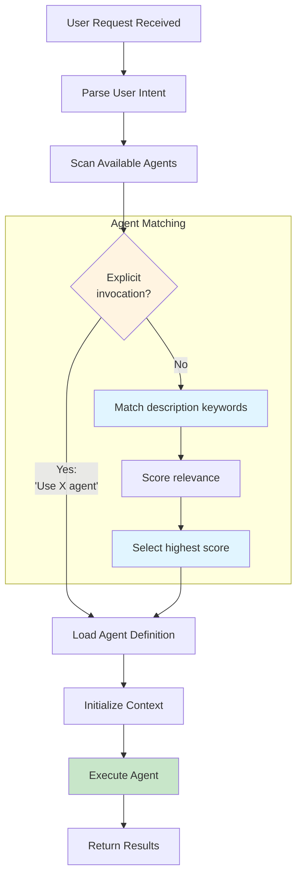
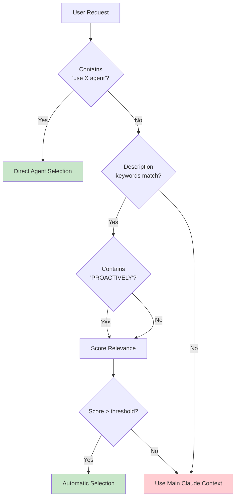
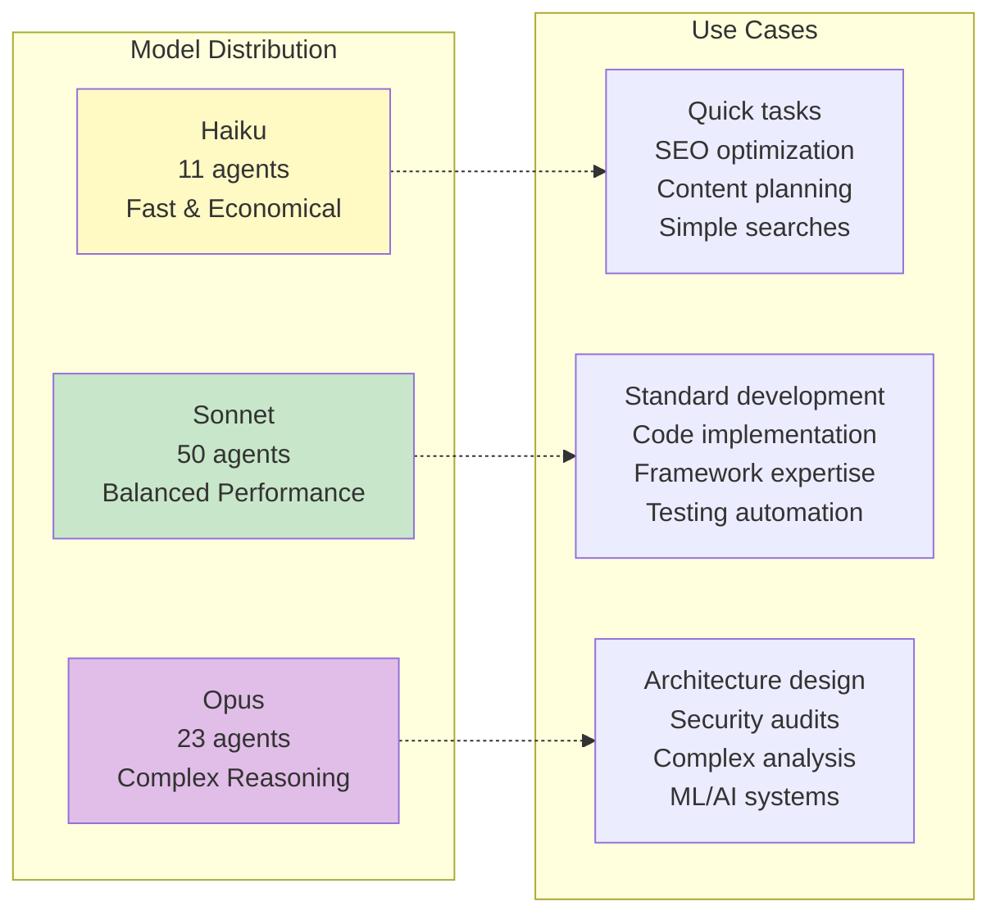
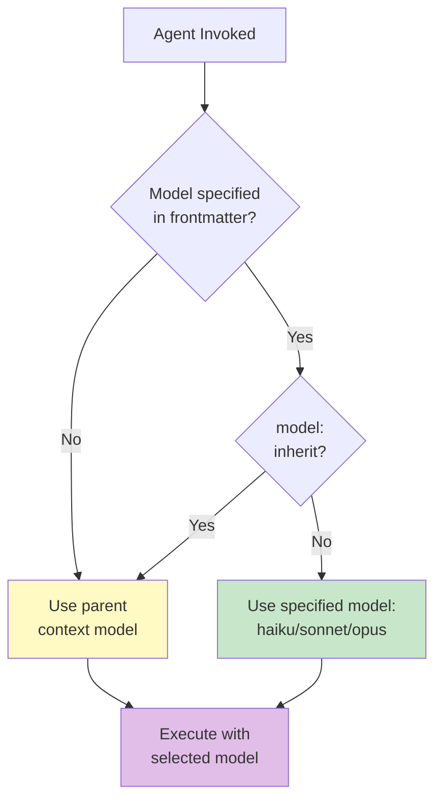
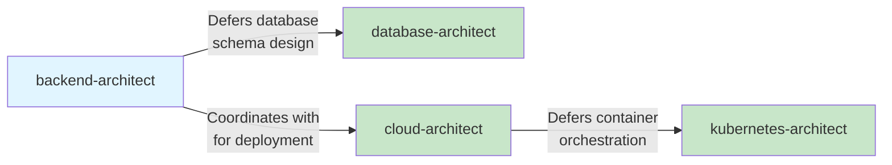
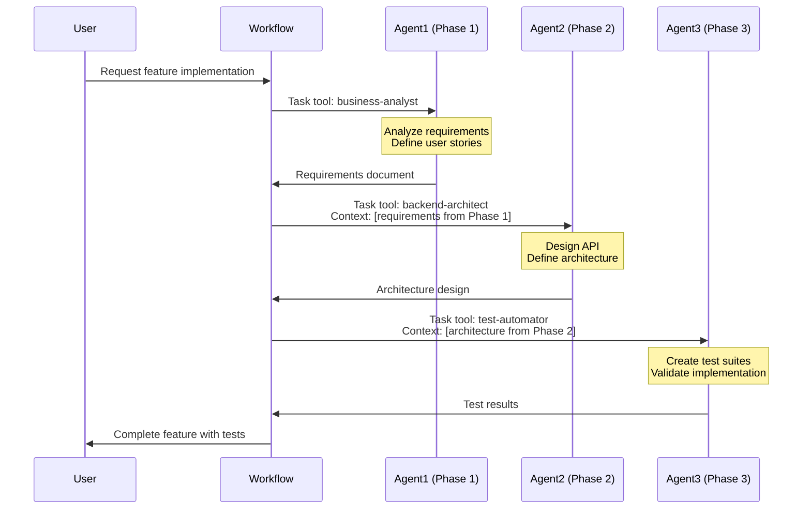
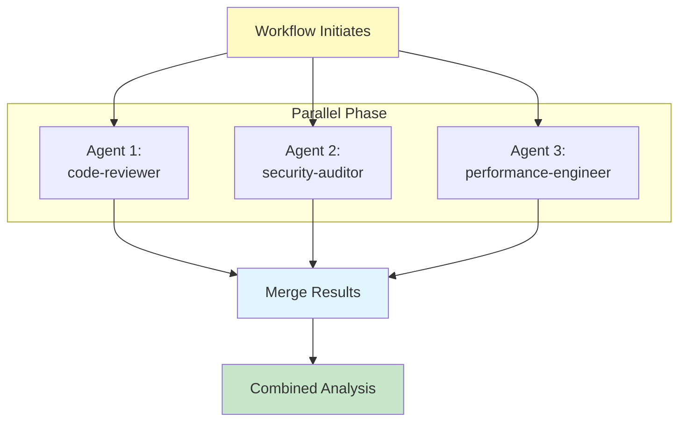
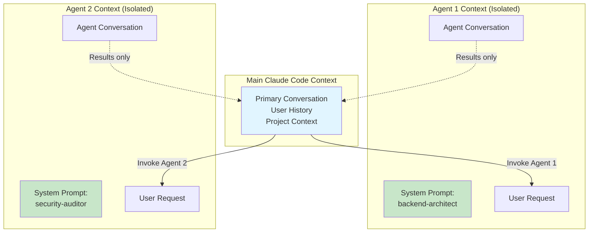

# Agent System Architecture

This document provides a comprehensive deep dive into the Claude Code subagent system, covering agent lifecycle, invocation mechanisms, model selection, coordination patterns, and best practices.

## Table of Contents

- [Agent Fundamentals](#agent-fundamentals)
- [Agent Lifecycle](#agent-lifecycle)
- [Invocation Mechanisms](#invocation-mechanisms)
- [Model Selection Strategy](#model-selection-strategy)
- [Agent Coordination Patterns](#agent-coordination-patterns)
- [Context Management](#context-management)
- [Best Practices](#best-practices)
- [References](#references)

## Agent Fundamentals

### What is a Subagent?

A subagent is a specialized AI assistant within Claude Code with:

- **Dedicated Purpose**: Focused expertise in a specific domain
- **Separate Context**: Isolated context window from the main conversation
- **Custom Behaviour**: Guided by a unique system prompt
- **Configurable Tools**: Optional restrictions on available tools
- **Model Selection**: Ability to use different model tiers (haiku/sonnet/opus)

**Official Reference**: [Claude Code Subagents](https://docs.claude.com/en/docs/claude-code/sub-agents)

### Agent Definition Structure

Agents are defined in Markdown files with YAML frontmatter:

```markdown
---
name: agent-name
description: When and why this agent should be invoked
model: sonnet  # Optional: haiku, sonnet, opus, or inherit
tools: tool1, tool2  # Optional: restrict available tools
---

System prompt defining the agent's expertise, capabilities,
behavioural traits, and response approach.
```

### Storage Locations

Agents can be stored at two levels:

1. **Project-level**: `.claude/agents/` (highest priority)
2. **User-level**: `~/.claude/agents/`

When agent names conflict, **project-level agents override user-level agents**.

## Agent Lifecycle

### Discovery and Selection



### Agent Initialization Process

When an agent is invoked:

1. **Load Definition**: Read agent frontmatter and system prompt
2. **Model Selection**: Determine model tier (see [Model Selection Strategy](#model-selection-strategy))
3. **Tool Configuration**: Apply tool restrictions if specified
4. **Context Isolation**: Create separate context window
5. **Prompt Construction**: Combine system prompt + user request
6. **Execution**: Process request with selected model
7. **Result Return**: Send output back to Claude Code

## Invocation Mechanisms

### Automatic Invocation

Claude Code automatically selects agents based on description matching:

**Example Agent Description**:
```yaml
description: Expert backend architect specializing in scalable API design.
  Masters REST/GraphQL/gRPC APIs. Use PROACTIVELY when creating new backend
  services or APIs.
```

**Trigger Phrases**:
- **"Use PROACTIVELY"**: Strong signal for automatic selection
- **Domain keywords**: "API design", "scalable", "REST", "GraphQL"
- **Intent matching**: "Create backend service" → triggers backend-architect

### Explicit Invocation

Users can directly request specific agents:

```
"Use the backend-architect agent to design an authentication API"
"Have security-auditor scan this code for vulnerabilities"
"Get performance-engineer to optimize these database queries"
```

### Invocation Decision Tree



## Model Selection Strategy

### Model Tiers

This marketplace uses three model tiers based on task complexity:



### Model Selection Algorithm



### Model Tier Guidelines

#### Haiku Agents (11 agents)

**Characteristics**:
- Fast execution
- Lower computational cost
- Deterministic tasks
- Minimal reasoning required

**Examples**:
- `seo-meta-optimizer`: Meta tag optimization
- `seo-keyword-strategist`: Keyword analysis
- `context-manager`: Context tracking
- `search-specialist`: Web searches

#### Sonnet Agents (50 agents)

**Characteristics**:
- Balanced performance and cost
- Standard development tasks
- Framework and language expertise
- Most common use cases

**Examples**:
- `python-pro`: Python development
- `frontend-developer`: React/Next.js implementation
- `test-automator`: Test suite creation
- `deployment-engineer`: CI/CD and deployment

#### Opus Agents (23 agents)

**Characteristics**:
- Complex reasoning
- Architectural decisions
- Security-critical tasks
- Advanced analysis

**Examples**:
- `backend-architect`: API and service architecture
- `security-auditor`: Vulnerability assessment
- `ml-engineer`: Machine learning pipelines
- `code-reviewer`: Production reliability review

## Agent Coordination Patterns

### Deference Pattern

Agents defer to specialists for their areas of expertise:



**Example from `backend-architect` agent**:
> "Defers database schema design to database-architect (works after data layer is designed)"

### Workflow Orchestration Pattern

Workflows coordinate multiple agents through phases:



### Parallel Execution Pattern

Some workflows execute agents in parallel for independent tasks:



## Context Management

### Context Isolation

Each agent operates in a **separate context window**:



**Benefits**:
- Prevents context pollution
- Maintains agent focus
- Enables parallel execution
- Clear responsibility boundaries

### Context Passing in Workflows

Workflows explicitly pass context between phases:

```markdown
## Phase 2: Implementation
- Use Task tool with subagent_type="backend-architect"
- Prompt: "Implement backend services for: X.
  Follow technical design: [include architecture from step 2]..."
- Expected output: Backend service code
- Context: Architecture designs from Phase 1, database schema
```

## Best Practices

### 1. Agent Definition

✅ **Do**:
- Write clear, specific descriptions
- Include "use PROACTIVELY" for automatic invocation
- Specify appropriate model tier
- Define clear expertise boundaries
- Document when to defer to other agents

❌ **Don't**:
- Create overly broad agent descriptions
- Overlap responsibilities with existing agents
- Skip model specification (leads to unpredictable behaviour)
- Make agents depend on undocumented context

### 2. Model Selection

✅ **Do**:
- Use **haiku** for simple, deterministic tasks
- Use **sonnet** for standard development work
- Use **opus** for architecture, security, complex reasoning
- Consider cost-performance trade-offs

❌ **Don't**:
- Use opus for simple tasks (unnecessary cost)
- Use haiku for complex reasoning (poor results)
- Leave model unspecified without good reason

### 3. Agent Coordination

✅ **Do**:
- Implement clear deference patterns
- Document agent dependencies
- Pass explicit context between workflow phases
- Use parallel execution when tasks are independent

❌ **Don't**:
- Create circular dependencies
- Assume agents share context
- Skip context passing documentation
- Force sequential execution of independent tasks

### 4. Tool Configuration

✅ **Do**:
- Restrict tools for security-sensitive agents
- Grant minimal necessary tool access
- Document why tools are restricted

❌ **Don't**:
- Give all agents unrestricted tool access
- Over-restrict tools without testing
- Forget to document tool restrictions

## References

### Official Documentation

- [Subagents](https://docs.claude.com/en/docs/claude-code/sub-agents)
- [Plugins](https://docs.claude.com/en/docs/claude-code/plugins)
- [Claude Code Overview](https://docs.claude.com/en/docs/claude-code/overview)

### Related Documentation

- [System Architecture Overview](./system-overview.md)
- [Workflow Orchestration Patterns](./workflow-patterns.md)
- [Agent Frontmatter API Specification](../api/agent-frontmatter-spec.md)

### Agent Examples in This Repository

- [`backend-architect.md`](../../agents/backend-architect.md) - Opus agent with comprehensive architecture
- [`python-pro.md`](../../agents/python-pro.md) - Sonnet agent for language expertise
- [`seo-meta-optimizer.md`](../../agents/seo-meta-optimizer.md) - Haiku agent for focused tasks

---

**Next Steps**:
- Explore [Workflow Orchestration Patterns](./workflow-patterns.md) for multi-agent coordination
- Review [Agent Frontmatter Specification](../api/agent-frontmatter-spec.md) for detailed API reference
- Study example agents in the [agents/](../../agents/) directory
