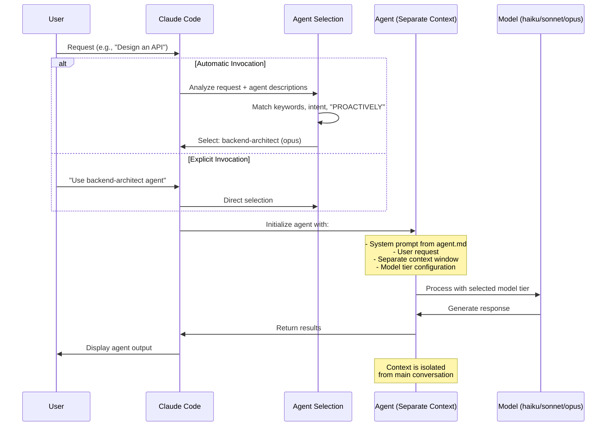
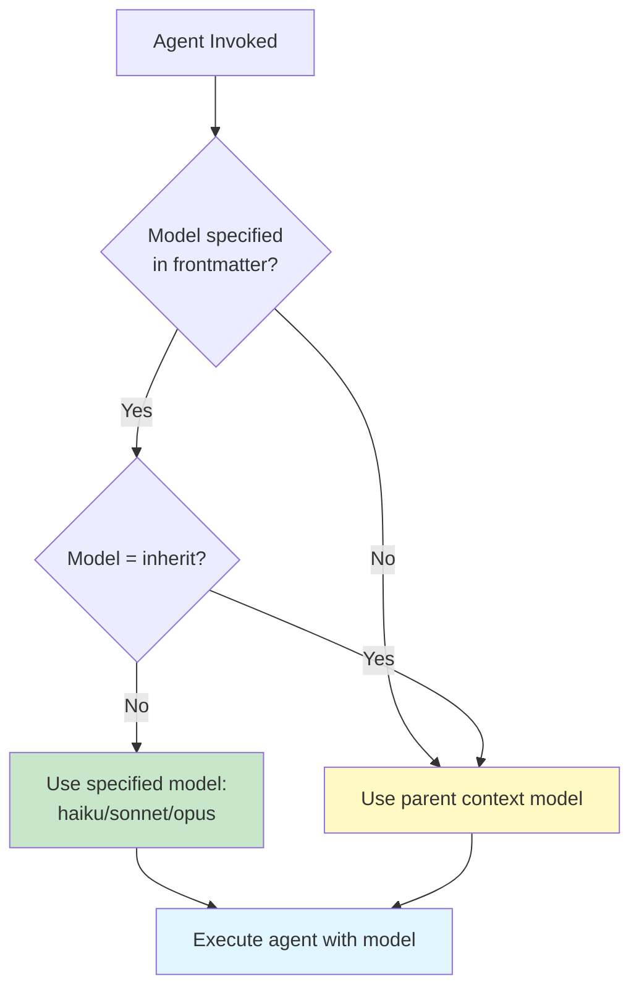
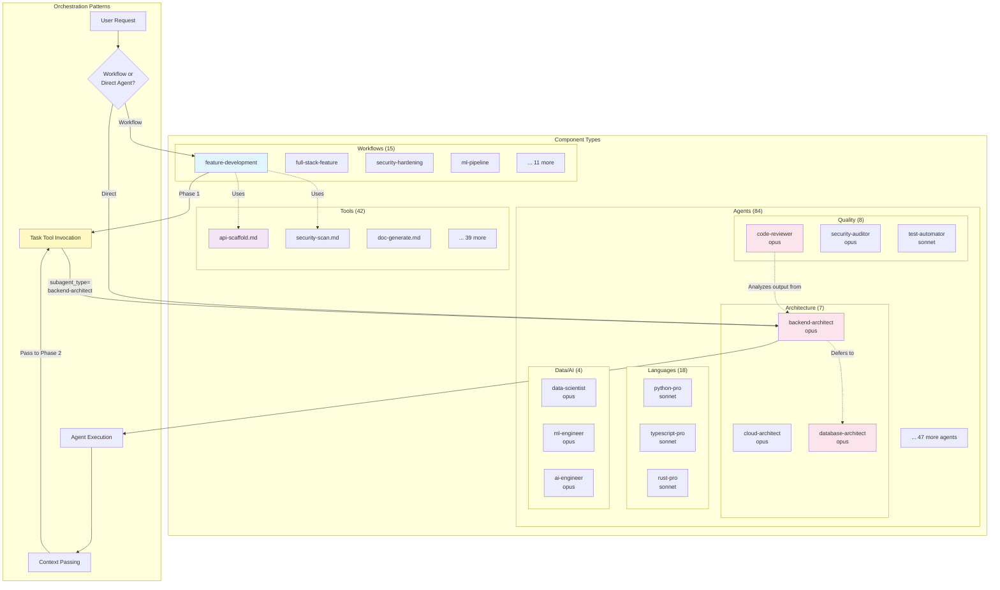

# System Architecture Overview

This document provides a comprehensive overview of the Claude Code Agents Marketplace architecture, including plugin structure, agent invocation mechanisms, and component relationships.

## Table of Contents

- [Plugin Marketplace Architecture](#plugin-marketplace-architecture)
- [Agent Invocation Architecture](#agent-invocation-architecture)
- [Component Architecture](#component-architecture)
- [Key Architectural Principles](#key-architectural-principles)
- [References](#references)

## Plugin Marketplace Architecture

This repository functions as a Claude Code plugin marketplace, distributing specialized agents, workflows, and tools through a structured plugin system.

### Architecture Diagram

```mermaid
graph TB
    subgraph "Marketplace Repository"
        MKT[marketplace.json<br/>Marketplace Catalog]

        subgraph "Plugin Definitions"
            P1[Plugin: claude-code-essentials]
            P2[Plugin: full-stack-development]
            P3[Plugin: security-hardening]
            PN[Plugin: ... 21 more plugins]
        end
    end

    subgraph "Plugin Components"
        subgraph "Agents Directory"
            A1[backend-architect.md]
            A2[frontend-developer.md]
            AN[... 84 agents total]
        end

        subgraph "Workflows Directory"
            W1[feature-development.md]
            W2[full-stack-feature.md]
            WN[... 15 workflows total]
        end

        subgraph "Tools Directory"
            T1[api-scaffold.md]
            T2[doc-generate.md]
            TN[... 42 tools total]
        end
    end

    subgraph "Claude Code Installation"
        USER[User runs:<br/>/plugin marketplace add<br/>wshobson/agents]
        BROWSE[/plugin command<br/>Browse available plugins]
        INSTALL[Plugin Installation]
    end

    subgraph "Runtime Environment"
        PROJECT[".claude/agents/<br/>(project-level)"]
        USERLVL["~/.claude/agents/<br/>(user-level)"]
        PRECEDENCE[Project agents<br/>override user agents]
    end

    MKT --> P1
    MKT --> P2
    MKT --> P3
    MKT --> PN

    P1 -.->|references| A1
    P1 -.->|references| T1
    P2 -.->|references| A2
    P2 -.->|references| W1
    P3 -.->|references| A1

    USER --> MKT
    MKT --> BROWSE
    BROWSE --> INSTALL
    INSTALL --> PROJECT
    INSTALL --> USERLVL
    PROJECT --> PRECEDENCE
    USERLVL --> PRECEDENCE

    style MKT fill:#e1f5ff
    style PRECEDENCE fill:#fff4e1
    style PROJECT fill:#e8f5e9
    style USERLVL fill:#f3e5f5
```

### Installation Flow

1. **Marketplace Addition**: User adds marketplace with `/plugin marketplace add wshobson/agents`
2. **Plugin Discovery**: Browse plugins using `/plugin` command
3. **Plugin Installation**: Select and install specific plugin(s)
4. **Agent Registration**: Agents are copied to `.claude/agents/` (project) or `~/.claude/agents/` (user)
5. **Precedence Resolution**: Project-level agents take priority over user-level agents

**Official Documentation**: [Plugin Marketplaces](https://docs.claude.com/en/docs/claude-code/plugin-marketplaces)

## Agent Invocation Architecture

Agents can be invoked automatically (based on description matching) or explicitly (direct user request). Each agent runs in a separate context window with configurable model tiers.

### Invocation Flow Diagram



### Model Selection Logic



**Model Distribution**:
- **Haiku** (11 agents): Quick tasks, SEO, search, content
- **Sonnet** (50 agents): Standard development, language expertise
- **Opus** (23 agents): Architecture, security, complex analysis, ML/AI

**Official Documentation**: [Subagents](https://docs.claude.com/en/docs/claude-code/sub-agents)

## Component Architecture

The marketplace provides three types of components that work together to enable complex development workflows.

### Component Hierarchy



### Agent Specialization and Deference

Agents follow a **deference pattern** where specialized agents delegate specific tasks to domain experts:

- **backend-architect** defers database schema design to **database-architect**
- **cloud-architect** defers container optimization to **kubernetes-architect**
- **performance-engineer** defers query optimization to **database-optimizer**

This ensures deep expertise in each domain while maintaining clear boundaries.

### Workflow Orchestration

Workflows coordinate multiple agents through phases:

**Example: `feature-development` workflow**
1. **Phase 1: Discovery** → `business-analyst`, `architect-review`
2. **Phase 2: Implementation** → `backend-architect`, `frontend-developer`
3. **Phase 3: Testing** → `test-automator`, `security-auditor`
4. **Phase 4: Deployment** → `deployment-engineer`, `observability-engineer`

Each phase uses the **Task tool** to invoke agents:
```markdown
- Use Task tool with subagent_type="backend-architect"
- Prompt: "Implement services for: X. Using architecture from Phase 1..."
```

## Key Architectural Principles

### 1. Separation of Concerns
- **Agents**: Specialized domain expertise
- **Workflows**: Orchestration and coordination
- **Tools**: Focused utilities and code generation

### 2. Context Isolation
- Each agent runs in a separate context window
- Prevents context pollution
- Enables parallel agent execution
- Maintains focus on specific tasks

### 3. Model Tier Optimization
- **Haiku**: Fast, deterministic, low-cost tasks
- **Sonnet**: Balanced performance for most development tasks
- **Opus**: Complex reasoning, architecture, critical analysis

### 4. Progressive Enhancement
- Start with essentials (claude-code-essentials plugin)
- Add workflow orchestration as needed
- Install specialized plugins for specific domains
- Custom plugins for team-specific needs

### 5. Explicit over Implicit
- Clear frontmatter specifications
- Well-defined invocation descriptions
- Documented context passing
- Traceable workflow phases

## References

### Official Claude Code Documentation

- [Claude Code Overview](https://docs.claude.com/en/docs/claude-code/overview)
- [Subagents](https://docs.claude.com/en/docs/claude-code/sub-agents)
- [Plugins](https://docs.claude.com/en/docs/claude-code/plugins)
- [Plugin Marketplaces](https://docs.claude.com/en/docs/claude-code/plugin-marketplaces)
- [Plugins Reference](https://docs.claude.com/en/docs/claude-code/plugins-reference)

### Related Documentation in This Repository

- [Agent System Deep Dive](./agent-system.md)
- [Workflow Orchestration Patterns](./workflow-patterns.md)
- [Agent Frontmatter Specification](../api/agent-frontmatter-spec.md)
- [Workflow Specification](../api/workflow-spec.md)
- [Plugin Manifest Specification](../api/plugin-manifest-spec.md)

### Community Resources

- [Repository Homepage](https://github.com/wshobson/agents)
- [Issue Tracker](https://github.com/wshobson/agents/issues)
- [Contributing Guidelines](../../.github/CONTRIBUTING.md)

---

**Next Steps**:
- Review [Agent System Architecture](./agent-system.md) for deeper understanding of agent mechanics
- Explore [Workflow Patterns](./workflow-patterns.md) to learn orchestration strategies
- Check [API Reference](../api/) for specifications and examples
