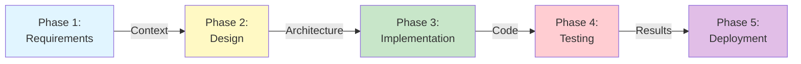
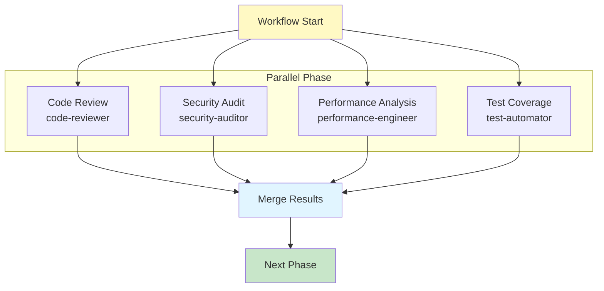
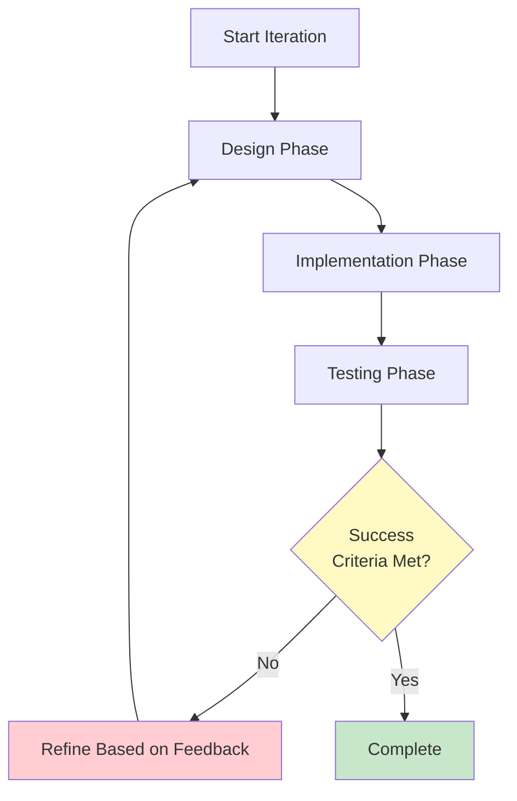
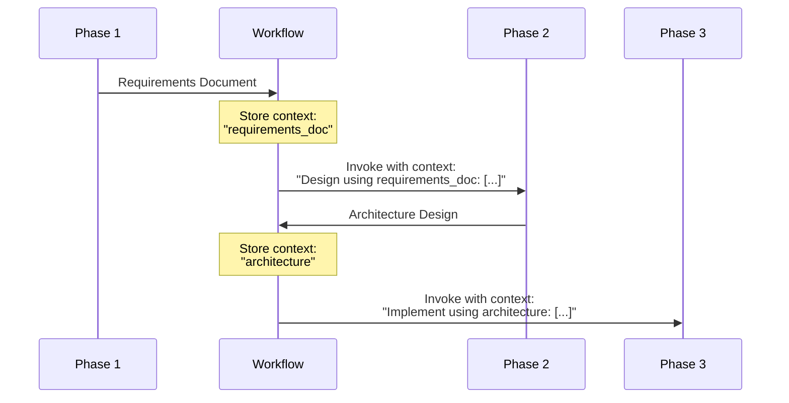

# Workflow Orchestration Patterns

Multi-agent workflows coordinate specialized agents through structured phases to accomplish complex development tasks. This document covers orchestration patterns, phase management, and context passing strategies.

## Table of Contents

- [Workflow Fundamentals](#workflow-fundamentals)
- [Orchestration Patterns](#orchestration-patterns)
- [Phase Management](#phase-management)
- [Context Passing](#context-passing)
- [Example Workflows](#example-workflows)
- [Best Practices](#best-practices)
- [References](#references)

## Workflow Fundamentals

### What is a Workflow?

A workflow is a multi-phase orchestration system that coordinates multiple specialized agents to accomplish complex tasks. Workflows:

- Define sequential or parallel execution phases
- Invoke agents using the Task tool
- Pass context between phases
- Define success criteria and rollback strategies

### Workflow Structure

```markdown
## Phase N: Phase Name

### Step N.M: Step Description
- Use Task tool with subagent_type="agent-name"
- Prompt: "Task description with context: [reference previous outputs]"
- Expected output: What this step produces
- Context: Information passed from previous phases
```

**Official Reference**: [Subagents - Task Tool Integration](https://docs.claude.com/en/docs/claude-code/sub-agents)

## Orchestration Patterns

### 1. Sequential Pipeline Pattern

Phases execute in sequence, each building on previous outputs.



**Example**: [`feature-development.md`](../../workflows/feature-development.md)

**Phases**:
1. Discovery & Requirements (business-analyst)
2. Design (architect-review)
3. Implementation (backend-architect, frontend-developer)
4. Testing (test-automator, security-auditor)
5. Deployment (deployment-engineer)

### 2. Parallel Execution Pattern

Independent tasks execute simultaneously for efficiency.



**Example**: [`full-review.md`](../../workflows/full-review.md)

**Usage**:
- Quality assurance reviews
- Multi-perspective analysis
- Independent validation tasks

### 3. Iterative Refinement Pattern

Cycles through phases until success criteria met.



**Example**: [`tdd-cycle.md`](../../workflows/tdd-cycle.md)

**Phases**:
1. Write tests (Red)
2. Implement code (Green)
3. Refactor (Refactor)
4. Repeat until complete

## Phase Management

### Phase Definition Format

Each phase specifies:

```markdown
## Phase N: Phase Name

### Step N.M: Step Description
- **Tool Invocation**: Use Task tool with subagent_type="agent-name"
- **Prompt**: Detailed instructions including:
  - Task description
  - Context from previous phases: [explicit references]
  - Expected deliverables
- **Expected Output**: Specific artifacts produced
- **Context for Next Phase**: What gets passed forward
```

### Task Tool Invocation

The Task tool is Claude Code's mechanism for invoking agents:

```markdown
- Use Task tool with subagent_type="backend-architect"
- Prompt: "Design backend architecture for: $ARGUMENTS.
  Using database schema from Phase 1: [include schema].
  Consider scalability requirements: [include requirements]."
```

### Configuration Options

Workflows define configurable parameters:

```markdown
## Configuration Options
- `methodology`: traditional|tdd|bdd|ddd
- `complexity`: simple|medium|complex|epic
- `deployment-strategy`: direct|canary|feature-flag|blue-green
```

## Context Passing

### Explicit Context References

Context must be explicitly passed between phases:



### Context Passing Example

**Phase 1 Output**:
```markdown
- Expected output: Requirements document with user stories, acceptance criteria
```

**Phase 2 Input**:
```markdown
- Prompt: "Design architecture for: $ARGUMENTS.
  Using requirements from Phase 1:
  [USER STORIES]
  - User can authenticate via OAuth2
  - User can manage profile
  [ACCEPTANCE CRITERIA]
  - API response time < 200ms
  - Support 10,000 concurrent users"
```

## Example Workflows

### Feature Development Workflow

**File**: [`feature-development.md`](../../workflows/feature-development.md)

**Phases**:
1. **Discovery** (business-analyst, architect-review)
2. **Implementation** (backend-architect, frontend-developer, data-engineer)
3. **Testing** (test-automator, security-auditor)
4. **Deployment** (deployment-engineer, observability-engineer)

**Pattern**: Sequential pipeline with explicit context passing

### Full-Stack Feature Workflow

**File**: [`full-stack-feature.md`](../../workflows/full-stack-feature.md)

**Phases**:
1. **Architecture Foundation** (database-architect, backend-architect, frontend-developer)
2. **Parallel Implementation** (python-pro, frontend-developer, sql-pro)
3. **Integration & Testing** (test-automator, security-auditor)
4. **Deployment & Operations** (deployment-engineer, performance-engineer)

**Pattern**: Mixed sequential and parallel execution

### Security Hardening Workflow

**File**: [`security-hardening.md`](../../workflows/security-hardening.md)

**Phases**:
1. **Security Assessment** (security-auditor)
2. **Parallel Remediation** (backend-security-coder, frontend-security-coder, mobile-security-coder)
3. **Validation** (test-automator, security-auditor)

**Pattern**: Assessment → parallel remediation → validation

## Best Practices

### 1. Phase Design

✅ **Do**:
- Keep phases focused on single concerns
- Define clear success criteria for each phase
- Specify rollback procedures
- Document phase dependencies

❌ **Don't**:
- Create overly granular phases (too many steps)
- Mix unrelated concerns in one phase
- Leave success criteria vague
- Skip rollback planning

### 2. Context Management

✅ **Do**:
- Explicitly reference previous phase outputs
- Include relevant excerpts in prompts
- Document what context flows between phases
- Use structured format for context

❌ **Don't**:
- Assume agents share context
- Pass entire documents (summarize key points)
- Omit critical context to save tokens
- Use ambiguous references

### 3. Agent Selection

✅ **Do**:
- Choose specialists for each phase
- Consider model tiers appropriately
- Allow parallel execution when possible
- Document agent coordination patterns

❌ **Don't**:
- Use generalist agents for specialized tasks
- Force sequential execution unnecessarily
- Mix model tiers without reason
- Create circular dependencies

### 4. Success Criteria

✅ **Do**:
- Define measurable success criteria
- Include both functional and non-functional requirements
- Specify test coverage thresholds
- Document acceptance gates

❌ **Don't**:
- Use subjective criteria
- Skip performance requirements
- Omit security criteria
- Forget deployment validation

## References

### Official Documentation

- [Subagents](https://docs.claude.com/en/docs/claude-code/sub-agents)
- [Claude Code Overview](https://docs.claude.com/en/docs/claude-code/overview)

### Related Documentation

- [System Architecture Overview](./system-overview.md)
- [Agent System Architecture](./agent-system.md)
- [Workflow API Specification](../api/workflow-spec.md)

### Example Workflows

- [`feature-development.md`](../../workflows/feature-development.md)
- [`full-stack-feature.md`](../../workflows/full-stack-feature.md)
- [`security-hardening.md`](../../workflows/security-hardening.md)
- [`ml-pipeline.md`](../../workflows/ml-pipeline.md)
- [`tdd-cycle.md`](../../workflows/tdd-cycle.md)

---

**Next Steps**:
- Review [Workflow API Specification](../api/workflow-spec.md) for detailed format reference
- Study example workflows in the [workflows/](../../workflows/) directory
- Create custom workflows for your team's specific needs
